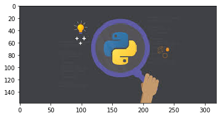
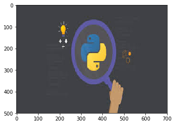
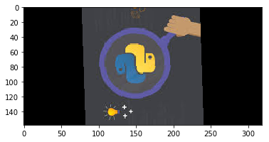
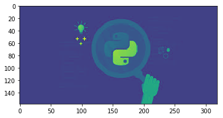
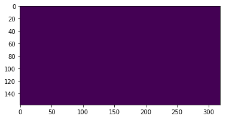
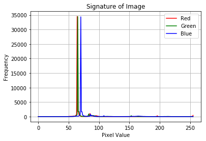

# <font color="Tomato">ImageKit </font>Package
### A simple python package for basic Image Processing for beginners

### 1. Installing Package


```python
pip install git+https://github.com/syamkakarla98/Image-Kit.git
```

    Collecting git+https://github.com/syamkakarla98/Image-Kit.git
      Cloning https://github.com/syamkakarla98/Image-Kit.git to /tmp/pip-req-build-6aa9lngi
    Requirement already satisfied (use --upgrade to upgrade): Image-Kit==1.0.0 from git+https://github.com/syamkakarla98/Image-Kit.git in /srv/conda/lib/python3.6/site-packages
    Requirement already satisfied: numpy in /srv/conda/lib/python3.6/site-packages (from Image-Kit==1.0.0) (1.16.3)
    Requirement already satisfied: matplotlib in /srv/conda/lib/python3.6/site-packages (from Image-Kit==1.0.0) (3.0.3)
    Requirement already satisfied: Pillow in /srv/conda/lib/python3.6/site-packages (from Image-Kit==1.0.0) (6.0.0)
    Requirement already satisfied: scipy in /srv/conda/lib/python3.6/site-packages (from Image-Kit==1.0.0) (1.2.1)
    Requirement already satisfied: cycler>=0.10 in /srv/conda/lib/python3.6/site-packages (from matplotlib->Image-Kit==1.0.0) (0.10.0)
    Requirement already satisfied: kiwisolver>=1.0.1 in /srv/conda/lib/python3.6/site-packages (from matplotlib->Image-Kit==1.0.0) (1.0.1)
    Requirement already satisfied: pyparsing!=2.0.4,!=2.1.2,!=2.1.6,>=2.0.1 in /srv/conda/lib/python3.6/site-packages (from matplotlib->Image-Kit==1.0.0) (2.4.0)
    Requirement already satisfied: python-dateutil>=2.1 in /srv/conda/lib/python3.6/site-packages (from matplotlib->Image-Kit==1.0.0) (2.8.0)
    Requirement already satisfied: six in /srv/conda/lib/python3.6/site-packages (from cycler>=0.10->matplotlib->Image-Kit==1.0.0) (1.12.0)
    Requirement already satisfied: setuptools in /srv/conda/lib/python3.6/site-packages (from kiwisolver>=1.0.1->matplotlib->Image-Kit==1.0.0) (40.8.0)
    Building wheels for collected packages: Image-Kit
      Building wheel for Image-Kit (setup.py) ... [?25ldone
    [?25h  Stored in directory: /tmp/pip-ephem-wheel-cache-jfihyo34/wheels/86/91/2c/89b389a7ca0e7839e1b079068e5f48751c0f1acba07f84bb59
    Successfully built Image-Kit
    Note: you may need to restart the kernel to use updated packages.


### 2. Importing Package


```python
from ImageKit import ImgKit as i
```

### 3. Imformation about package


```python
help(i)
```

    Help on module ImageKit.ImgKit in ImageKit:
    
    NAME
        ImageKit.ImgKit
    
    FUNCTIONS
        get_band(img, band)
        
        get_pixels(img)
        
        get_properties(img)
        
        im2bw(img)
        
        imread(filename)
            Summary: Reads a iamge file and return an object.
                
            Args: filename.
                
            Returns: An object of an image.
        
        imrotate(img, degrees)
        
        imsave(img, filename)
        
        imshow(img)
            Summary: displays a iamge file and return an object.
            
            Args: filename.
        
        plot_signature(img)
        
        resize(img, s)
    
    FILE
        /srv/conda/lib/python3.6/site-packages/ImageKit/ImgKit.py
    
    


### 4. Downloading a sample image


```python
import urllib
urllib.request.urlretrieve("https://encrypted-tbn0.gstatic.com/images?q=tbn:ANd9GcS3kf6ZTospvdkbQ0G6xVraiA0tOTx8zrUDrP0aIsJ0cYLRb5nKag","fun.jpg")
```


    ('fun.jpg', <http.client.HTTPMessage at 0x7f82ccd712b0>)


### 5. Read the image


```python
x = i.imread('fun.jpg')
```

### 6.. Display the image


```python
i.imshow(x)
```





### 7. Description of the image


```python
desc = i.get_properties(x)
for name, value in zip(desc.keys(), desc.values()):
    print("%10s  => %1s"%(str(name), str(value)))
```

      filename  => fun.jpg
        format  => JPEG
          mode  => RGB
    dimensions  => (158, 319, 3)


### 8. Resize the image 


```python
x1 = i.resize(x, (700, 500))
i.imshow(x1)
```





### 9. Save the image


```python
i.imsave(x1, 'new_fun.jpg')
```

### 10. Rotating the image


```python
i.imshow(i.imrotate(x, 92))
```





### 11. Converting image to grayscale


```python
i.imshow(i.im2bw(x))
```





### 12. Extract pixels from the  image


```python
i.get_pixels(i.resize(x, (5, 5)))
```


    [(64, 65, 70),
     (64, 65, 70),
     (64, 65, 70),
     (64, 65, 70),
     (64, 65, 70),
     (64, 65, 70),
     (64, 65, 70),
     (35, 140, 170),
     (65, 66, 71),
     (64, 65, 70),
     (64, 65, 70),
     (65, 66, 71),
     (255, 215, 81),
     (64, 65, 70),
     (64, 65, 70),
     (64, 65, 70),
     (65, 66, 71),
     (97, 90, 167),
     (64, 65, 70),
     (64, 65, 70),
     (64, 65, 70),
     (64, 65, 70),
     (64, 65, 70),
     (54, 72, 58),
     (64, 65, 70)]


### 13. Extracting bands from the image


```python
i.imshow(i.get_band(x, 'r'))
i.imshow(i.get_band(x, 'g'))
i.imshow(i.get_band(x, 'b'))
```





### 14. Pixel signature of the image


```python
i.plot_signature(x)
```





# <center><font size= 95 style='font-family:Lucida Console' color ="mediumspringgreen">Thank You </font> </center>

# Do [star](https://github.com/syamkakarla98/Image-Kit) the repository, if you like it.


```python

```
